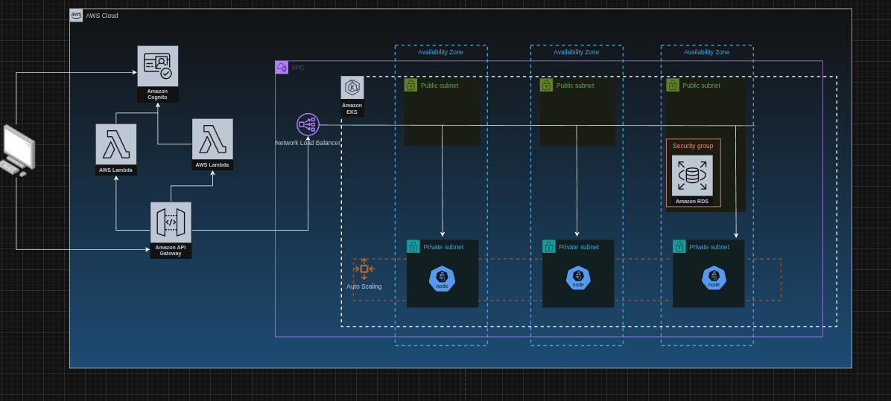

# BaitersBurger

## Detalhes da solução

Este projeto é uma aplicação Java com Spring Boot e MongoDB que segue os princípios da Clean Architecture com camadas distintas para domínio, aplicação, adaptadores de interface e frameworks & drivers.

O código de infraestrutura (Docker, K8s, Terraform) é mantido em um repositório separado: https://github.com/lucasnabeto/baiters-burger-infra.Hierarquia do projeto abaixo:

```
BaitersBurger/
├── .github/
│   └── workflows/  # Definição das esteiras do GitHub Actions
├── docs/
│   └── images/
├── k8s/                     # Definição dos manifestos do Kubernetes
│   ├── app-deployment.yaml
│   ├── app-service.yaml
│   ├── configmap.yaml
│   ├── hpa.yaml
│   └── namespace.yaml
├── src/
│   ├── main/
│   │   └── java/br/com/fiap/baitersburger/
│   │       ├── domain/             # Camada de Domínio (models, ports)
│   │       ├── application/        # Camada de Aplicação (use cases)
│   │       ├── interfaceadapters/  # Camada de Adaptadores de Interface (controllers da Clean Architecture, gateways, presentes)
│   │       └── infrastructure/     # Camada de Frameworks & Drivers (controllers REST)
│   └── test/
├── docker-compose.yaml
├── Dockerfile
├── pom.xml
└── README.md
```

### Fluxo de negócio

O cliente inicia o atendimento através de um totem da lanchonete e opta por se identificar ou realizar um pedido de forma anônima. Após essa etapa, o cliente escolhe os produtos desejados e finaliza a criação do pedido, que passa a ter o estado de "REQUESTED". Além disso, um código QR de pagamento é gerado por meio da integração com uma API do Mercado Pago.

Para que o pedido seja encaminhado para a cozinha, ele precisa ter seu estado em "RECEIVED". E essa atualização de estado será realizada apenas após o cliente realizar o pagamento via código QR, quando, então, o próprio Mercado Pago notificará sobre a ocorrência desse evento para o endpoint de webhook desta aplicação.

A partir desse momento, o pedido transitará pelos estados de "PREPARING", "READY" e "DELIVERED", conforme o fluxo da cozinha da lanchonete:


[Link para o arquivo do Excalidraw](./docs/business-flow.excalidraw)

### Infraestrutura

O GitHub Actions adota um papel fundamental para a execução da aplicação, visto que ele cria a infraestrutura na AWS, por meio de Terraform, e a criação de secrets do Kubernetes.

Através dos manifestos do Kubernetes, é criado um Network Load Balancer com certificado SSL para fazer a distribuição de tráfego, recebido via HTTPS, para os nodes (instâncias EC2 do tipo t2.medium) que estão rodando os pods que contêm a aplicação Java. No quesito de autoscaling, está configurado um mínimo de 1 réplica e um máximo de 2 réplicas, sendo que a métrica analisada é a utilização média de 75% da memória designada.



[Link para o arquivo do DrawIO](./docs/images/infra-solution.drawio)

### Explicação e demonstração

Para mais detalhes sobre a aplicação, foi disponibilizado um vídeo explicando os principais aspectos da arquitetura adotada, bem como demonstrando o funcionamento completo: [Grupo 55 - Tech Challenge Fase 2](https://www.youtube.com/watch?v=bNxd-jVBrq8)

## Como rodar a aplicação localmente

### Pré-requisitos

-   Docker
-   Docker Compose

### Pontos de atenção

-   Devido ao fato da aplicação possuir uma integração com a API do Mercado Pago, não é possível reproduzir na íntegra o fluxo demonstrado no vídeo acima sem a utilização de algum programa que gere um webhook local, como o ngrok, por exemplo.
-   O projeto faz uso do GitHub Actions para criação de infraestrutura na AWS, então o uso de um fork seria mais indicado.

### Etapas de execução

1. Clone este repositório:

    ```bash
    git clone https://github.com/lucasnabeto/BaitersBurger.git
    cd BaitersBurger
    ```

2. Configure a URI do MongoDB:

    - Vá até o arquivo "application.properties"
    - Modifique "spring.data.mongodb.uri" para apontar para o Mongo Atlas ou para o Mongo que será executado localmente através do docker compose

3. Construa e suba os containers:

    ```bash
    docker-compose up --build
    ```

    Isso irá:

    - Subir o MongoDB na porta 27017
    - Subir a aplicação na porta 8080

4. Acesse a aplicação:
    - API: [http://localhost:8080](http://localhost:8080)
    - Swagger: [http://localhost:8080/swagger-ui/index.html](http://localhost:8080/swagger-ui/index.html)

## Parar os containers

Para parar e remover os containers, execute:

```bash
docker-compose down
```

